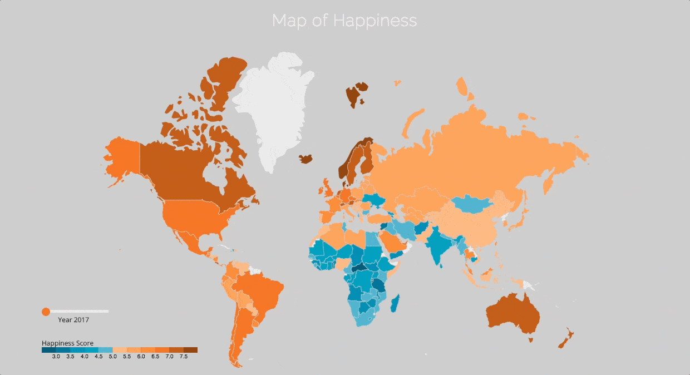

## Map of Happiness - A visualization project

#### [LIVE](http://happiness.katrinalui.com/)

### Background
The [World Happiness Report](http://worldhappiness.report/), published by the United Nations Sustainable Development Solutions Network, is a measure of happiness of countries around the globe. Variables that go into a country's happiness score include GDP per capita, social support, and freedom to make life choices.

### Technologies Used
+ JavaScript
+ D3.js
+ Webpack

### Features
Users are able to:
+ View a choropleth map of the world, indicating their happiness score
+ Hover over a country to view a breakdown of the country's happiness score
+ Toggle between data from previous years using a slider

